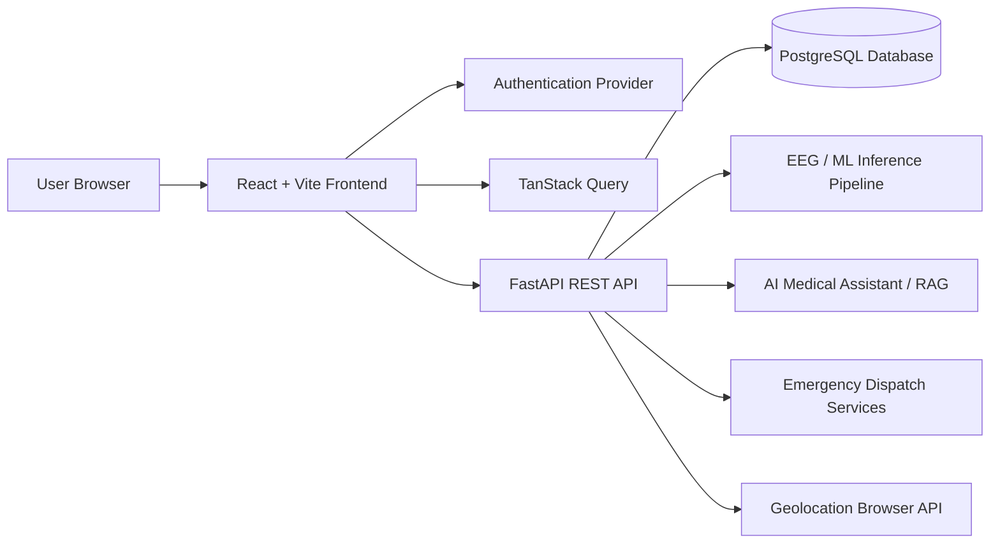
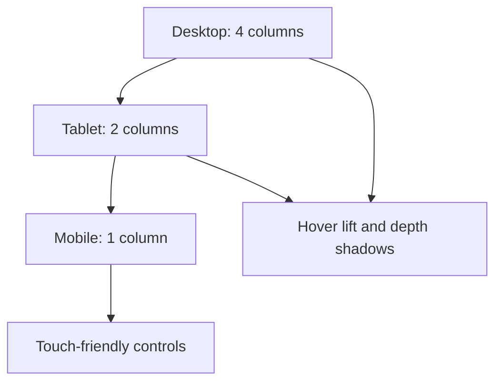
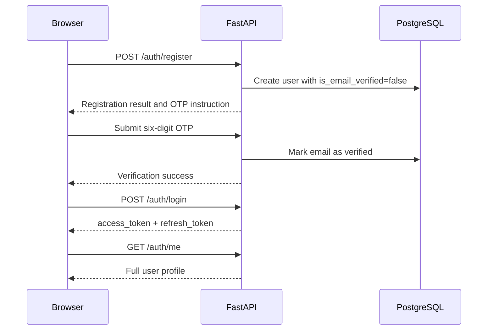
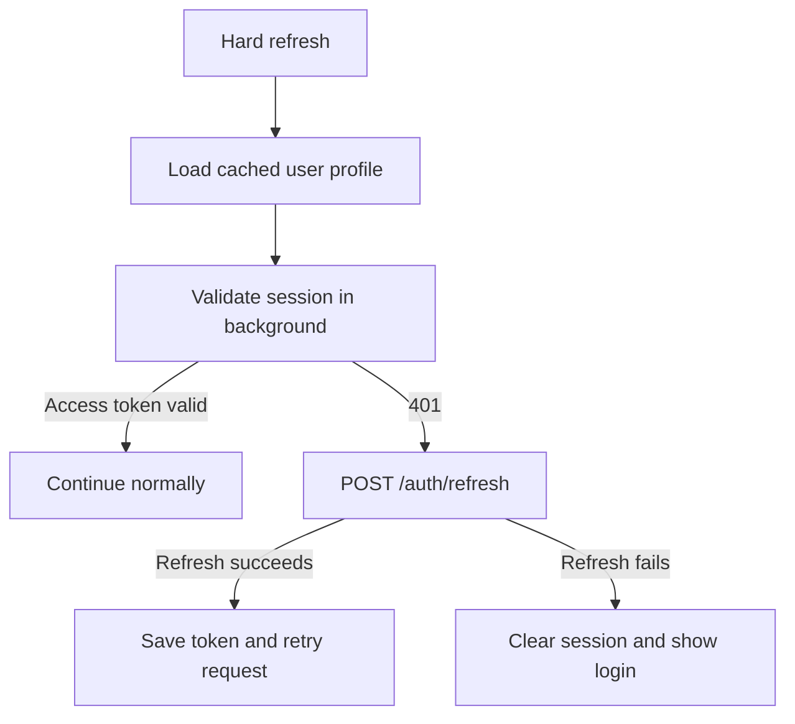
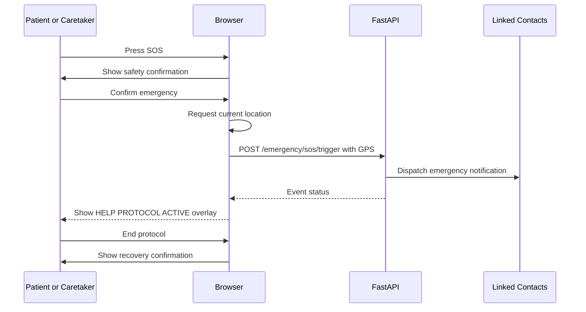
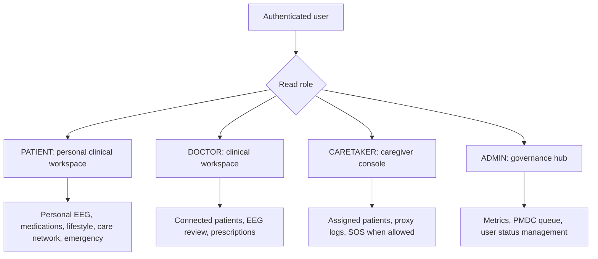

# EpiCare Neurology Platform

> **A simple, comprehensive explanation of the implementation transcript in `pasted_content.txt`.**

## 1. What This README Covers

This document explains the complete EpiCare implementation history recorded in the attached transcript. It translates the technical discussion into simple words and organizes the project into design, authentication, dashboards, EEG analysis, emergency response, medication tracking, care networks, role permissions, database alignment, navigation, and testing.

The original file is a **development conversation transcript**, not the source-code repository itself. It contains implementation reports, user feedback, bug explanations, route names, component names, test claims, and design decisions. Therefore, this README explains what the transcript says was built; it does not independently prove that every reported feature exists in the current repository.

### Important evidence note

The transcript repeatedly says that builds, linting, and tests passed. However, the attached file does not include the actual backend source files, `openapi.json`, `schema.sql`, migration files, test output, or frontend source code. A real repository audit is still required before calling the system production-ready.

| Item | Meaning in this README |
|---|---|
| **Reported complete** | The transcript says the feature was implemented and verified. |
| **Reported fixed** | The transcript describes a bug and a claimed fix. |
| **Needs repository verification** | The transcript makes a claim, but the attached file does not provide enough evidence to confirm it. |
| **Security caution** | The transcript contains information that should not be committed to a public repository, such as seeded credentials or personal test accounts. |

## 2. Project in One Sentence

EpiCare is a role-based epilepsy and neurology support platform. It is described as a React/Vite frontend connected to a FastAPI backend and PostgreSQL database. The platform supports patients, doctors, caretakers, and administrators through different screens and permissions.

## 3. High-Level Architecture

The transcript describes the following overall system:



In simple terms, the browser displays the application. The React frontend calls FastAPI endpoints. FastAPI reads and writes PostgreSQL data, starts EEG analysis, returns dashboard statistics, stores medication logs, handles permissions, and supports emergency workflows.

## 4. Technology Vocabulary in Simple Words

| Technical term | Simple meaning |
|---|---|
| **React** | A JavaScript library used to build interactive screens. |
| **Vite** | A fast tool used to run and build the frontend. |
| **TypeScript** | JavaScript with type checking. It catches many mistakes before the application runs. |
| **FastAPI** | A Python framework used to build the backend API. |
| **REST API** | A group of URLs that the frontend calls to read or change data. |
| **PostgreSQL** | The relational database described by the transcript. |
| **Alembic** | A database migration tool used to change the database structure safely. |
| **TanStack Query** | A frontend data-fetching and caching library. |
| **JWT access token** | A short-lived token used to authorize API requests. |
| **Refresh token** | A longer-lived token used to obtain a new access token. |
| **OTP** | A one-time verification code, described here as a six-digit code. |
| **EDF** | European Data Format, a common format for medical signal recordings such as EEG. |
| **STFT spectrogram** | A visual representation showing how signal frequencies change over time. |
| **CRUD** | Create, read, update, and delete. |
| **PMDC** | The medical registration verification concept referenced by the transcript. |
| **Proxy write access** | Permission allowing a caretaker to record data for a patient. |
| **Bento grid** | A dashboard layout made of cards with different sizes. |
| **Glassmorphism** | A visual style using translucent, blurred glass-like cards. |
| **Telemetry** | System or health status signals collected continuously in the background. |

## 5. What Was Built, in Plain Language

The transcript describes five major implementation phases, although it also refers to an earlier “Phase 0.” The safest interpretation is that Phase 0 was the initial foundation and Phases 1–5 added the main product modules.

| Phase | Main result | Main users |
|---|---|---|
| **Phase 0 / 1** | Design system, authentication providers, responsive shell, and patient dashboard | All roles, with different access rules |
| **Phase 2** | EEG upload, session history, AI analysis, probability chart, and spectrogram | Patients, doctors, and admins according to permission claims |
| **Phase 3** | Emergency SOS protocol, contacts, GPS, first-aid overlay, and dispatch history | Patients and caretakers, with admin visibility claims |
| **Phase 4** | Medications, lifestyle logs, patient profile, and AI chat | Patients, doctors, caretakers, and admins according to role claims |
| **Phase 5** | Admin governance, doctor verification, user management, and suspension controls | Administrators |

## 6. Design System and Visual Language

### 6.1 Color system

The transcript first describes two modes, then later says dark mode was completely removed. The final design direction in the transcript is **light mode only**.

| Design element | Reported final value or description |
|---|---|
| Main background | Warm sand / beige, approximately `#f7f5f0` |
| Primary green | Deep earthy green, approximately `#2d5a3f` |
| Medical accent | Medical blue, approximately `#0077b6` |
| Cards | White translucent glass cards |
| Emergency color | Red or crimson glow |
| Shadows | Deep floating shadows, including a reported 32px depth style |
| Accessibility | AAA-contrast goal and WCAG 2.2 AA focus-ring goal are claimed and should be tested independently |

### 6.2 Main design files mentioned

| File | Reported responsibility |
|---|---|
| `tokens.css` | Colors, spacing, shadows, and design tokens |
| `glass.css` | Frosted cards, blur, elevations, and status glows |
| `bento.css` | Responsive card-grid layout |
| `animations.css` | Entrance animations, loaders, and reduced-motion support |
| `AppShell.css` | Top bar, sidebar, workspace spacing, and glass dock styling |
| `Button.css` | Hover, pressed, danger, and focus states |
| `ChatPage.css` | AI chat layout and topic chips |
| `Pagination.css` | Accessible pagination styles |

### 6.3 Responsive layout

The original design describes a four-column desktop bento layout, a two-column tablet layout, and a one-column mobile layout.



### 6.4 Motion and accessibility

The transcript describes GPU-friendly entrance effects, animated skeleton loaders, hover lifts, pressed-button scaling, smooth page transitions, and a `prefers-reduced-motion` fallback. The intended behavior is that the interface feels responsive without creating unsafe or distracting motion for people with epilepsy.

A practical rule is:

> Motion should communicate a state change, not decorate every action.

For example, a short fade-and-slide transition between Dashboard and AI Assistant is reasonable. A rapidly flashing or strobing animation is not appropriate for an epilepsy-focused product.

## 7. Authentication and Session Management

### 7.1 Normal sign-up flow

The transcript says the backend creates a new user, generates a six-digit OTP, and initially marks the account as unverified.



### 7.2 Why login or signup originally failed

The transcript identifies three root causes.

| Root cause | What went wrong | Reported fix |
|---|---|---|
| OTP was required but not displayed | New users could not enter the code, so login returned a 403 verification error | Added the OTP step inside `SignupForm.tsx` |
| Backend error shapes were not parsed | The frontend expected only a flat `detail` string and sometimes showed “An error occurred” or `[object Object]` | Updated `client.ts` to read nested error envelopes, validation lists, and network errors |
| Login response contained tokens, not a user object | `AuthProvider.tsx` looked for `response.user`, so the user state stayed empty | Store tokens, then call `GET /auth/me` to load the profile |

### 7.3 Hard refresh behavior

The transcript says a hard refresh previously sent users back to the login page because React memory was cleared, the access token could be expired, and the 401 handler removed both tokens too early.

The reported solution has two parts:

1. `AuthProvider.tsx` stores the last validated user profile in `localStorage` under `auth_user`.
2. `client.ts` uses the refresh token when an access token expires, saves the new access token, and retries the original request.



### 7.4 Important security correction

The transcript contains real-looking test emails and a seeded administrator password. Those values should not appear in a public README, source repository, screenshots, or production environment. They should be rotated and replaced with environment variables or a secure secret manager.

## 8. Application Shell and Navigation

### 8.1 Sidebar and top bar evolution

The shell changed several times in the transcript. It began with a glass sidebar and theme controls. Dark mode was later removed. AI Chat and Profile were removed from the sidebar and moved to the top bar. Later, the top bar became a floating 3D glass “pipe” or capsule.

The intended final navigation is:

| Role | Main navigation concept |
|---|---|
| Patient | Dashboard, EEG Diagnostics, Medications, Lifestyle & Logs, Care Network, Emergency Protocol |
| Doctor | One Clinical Workspace containing patient cohort, diagnostic review, and prescribing tools |
| Caretaker | One Caregiver Console containing assigned patients, proxy logging, and SOS actions |
| Admin | One Admin Governance Hub containing metrics, PMDC verification, and user management |

The transcript also says that AI Assistant and Account Profile are opened from the floating top bar instead of the main sidebar.

### 8.2 Top bar controls

The reported final top bar contains a brand area, current page context, live status, AI Assistant, Emergency SOS, and the user profile dropdown.

| Control | Purpose |
|---|---|
| Brand capsule | Identifies EpiCare and the current role or workspace |
| Status pill | Shows a role-specific status such as “Safety: Active” or “System Status” |
| AI Assistant | Opens the clinical chat screen |
| Emergency SOS | Opens or triggers the emergency workflow, depending on the screen and user role |
| Profile pill | Opens account details and safe sign-out |
| Dashboard return | Appears on secondary pages so the user can return to the main console |

### 8.3 Why “AI 1122 Rescue” was renamed

The transcript explains that 1122 refers to Rescue 1122, the emergency ambulance helpline mentioned by the project. It originally appeared in labels such as “AI 1122 Ready.” The wording was later simplified to “Safety: Active · AI Monitor Online.”

The important distinction is this:

> An AI monitor is not the emergency service itself. It may help detect risk or prepare an emergency workflow, but it must not be described as a guaranteed replacement for a human clinician or emergency dispatcher.

### 8.4 Smooth screen transitions

The transcript says page changes were improved with Framer Motion and `AnimatePresence mode="wait"`, using a gentle opacity and vertical movement curve. It also says a “Dashboard” return button and active breadcrumb were added so users do not become trapped on Chat or Profile screens.

A simple navigation example is:

```text
Patient Dashboard
      |
      | click “AI Assistant”
      v
AI Clinical Assistant
      |
      | click “← Dashboard”
      v
Patient Dashboard
```

## 9. Patient Dashboard

The patient dashboard is described as a signature bento grid with six modules.

| Module | Component | Backend data or action |
|---|---|---|
| A. Sessions Preview | `SessionsPreview.tsx` | `GET /api/v1/eeg/sessions` |
| B. Risk Indicator | `RiskIndicator.tsx` | Dashboard risk summary endpoint |
| C. Medication Countdown | `MedicationCountdown.tsx` | Live dose timer and overdue alerts |
| D. SOS Button | `SOSButton.tsx` | `POST /api/v1/emergency/sos/trigger` |
| E. Seizure Chart | `SeizureChart.tsx` | `GET /api/v1/seizures/manual` and seven-day chart |
| F. Quick Actions | `QuickActions.tsx` | Shortcuts to frequently used workflows |

The transcript says the dashboard originally queried `/api/v1/dashboard/patient/summary`, while the backend exposed `GET /api/v1/dashboard`. The frontend was then changed to use the backend route and map the returned metrics into cards.

The dashboard also received null-safe checks for empty session and seizure data, plus an `ErrorBoundary.tsx` to show a recovery screen instead of a blank page.

## 10. EEG Diagnostics

### 10.1 What the feature does

The EEG workspace is described as a complete upload and analysis pipeline for EDF and CSV files up to 200 MB.

```mermaid
flowchart LR
    U[Choose EDF or CSV] --> V[Check file type and size]
    V --> UP[POST /eeg/upload]
    UP --> S[EEG session created]
    S --> A[POST /eeg/sessions/{id}/analyze]
    A --> P[GET /eeg/sessions/{id}/predictions]
    A --> SP[GET /eeg/sessions/{id}/spectrogram]
    P --> R[Classification and probability chart]
    SP --> R
```

### 10.2 Main files and responsibilities

| File or API function | Simple explanation |
|---|---|
| `api/eeg.ts` | Central place for EEG API calls |
| `uploadEEG` | Sends an EDF or CSV file using multipart form data |
| `listSessions` | Lists sessions with pagination, status, and date filters |
| `analyzeSession` | Starts backend machine-learning analysis |
| `getSessionPredictions` | Retrieves prediction-window statistics |
| `getSpectrogramUrl` | Builds the URL for the generated spectrogram image |
| `EEGUploadZone.tsx` | Drag-and-drop upload area with validation and progress |
| `EEGSessionCard.tsx` | Shows duration, sampling rate, channels, and pipeline status |
| `EEGAnalysisDetail.tsx` | Displays classification, confidence, chart, spectrogram, and metrics |
| `EEGPage.tsx` | Combines upload and history tabs |

### 10.3 Example session lifecycle

```text
UPLOADED
   |
   v
PREPROCESSING
   |
   v
INFERENCE_RUNNING
   |
   +--> COMPLETED --> show prediction windows and spectrogram
   |
   +--> FAILED ------> show error and retry guidance
```

### 10.4 Clinical safety meaning

The transcript describes results such as `SEIZURE` or `NON-SEIZURE`, confidence, positive-window count, peak probability, mean probability, and decision threshold. These values should be presented as **screening or decision-support results** unless a qualified clinical validation process supports stronger claims.

The clinical disclaimer included in the reported UI is important. A model prediction should not be used alone to diagnose epilepsy, change medication, or replace emergency care.

## 11. Emergency SOS Protocol

### 11.1 What the feature does

The emergency module is described as a full-screen command center for acute seizure events. It contains a large SOS trigger, confirmation behavior, GPS capture, quick-call cards, emergency contacts, first-aid steps, an elapsed timer, and a historical event log.



### 11.2 Emergency components

| Component | Purpose |
|---|---|
| `api/emergency.ts` | Emergency contacts, SOS trigger, and event-history calls |
| `EmergencyProtocolOverlay.tsx` | Full-screen instructions, timer, GPS, and quick calls |
| `EmergencyContactsManager.tsx` | Add, edit, remove, and prioritize contacts |
| `SeizureFirstAidGuide.tsx` | First-aid do/don’t guidance and emergency criteria |
| `EmergencyPage.tsx` | Main emergency hub and dispatch history |

### 11.3 First-aid content described by the transcript

The transcript lists steps such as clearing the area, cushioning the head, turning the person onto their side, and timing the seizure. It also refers to emergency escalation for a seizure lasting more than five minutes, status epilepticus, or breathing difficulty.

Because medical guidance can vary by patient and jurisdiction, the final product should have its first-aid copy reviewed by a qualified clinician and localized to the correct emergency number.

## 12. Medications and Adherence

### 12.1 Database-first principle

A major user requirement appears near the end of the transcript:

> Do not hardcode values. If something is missing from the backend, add it to the backend and run a migration if needed.

The reported medication work follows that principle. It adds database fields and calculates schedules from real records rather than using permanent frontend placeholders.

### 12.2 Reported database migration

The transcript names a migration called `63107fc227df_add_prescriber_and_details_to_medications.py`.

| Added field or relationship | Purpose |
|---|---|
| `prescribed_by_doctor_id` | Links a prescription to the doctor who issued it; deletion is reported as `SET NULL` |
| `generic_name` | Standard drug name |
| `brand_name` | Commercial brand name |
| `intake_timing` | Instructions such as taking medicine with water after meals |
| `end_date` | Date on which a prescription stops |
| Medication-log `notes` | Clinical notes about an intake event |

### 12.3 Medication API behavior

| Endpoint | Reported behavior |
|---|---|
| `GET /api/v1/medications/daily-schedule` | Builds morning, afternoon, and night dose windows and marks doses as taken or pending |
| `GET /api/v1/medications/adherence-stats` | Calculates seven-day and 30-day compliance and a risk level |
| `GET /api/v1/medications` | Returns paginated prescriptions and prescribing-doctor details |
| `POST /api/v1/medications/{id}/log` | Records that a dose was taken |
| `GET /api/v1/medications/logs` | Returns a paginated medication history |

The adherence formula reported in the transcript is:

```text
Compliance percentage = (taken doses / expected doses) × 100
```

### 12.4 Medication screen tabs

| Tab | What the user sees |
|---|---|
| Today’s Schedule | Morning, afternoon, and night cards with Mark Taken actions |
| Prescriptions & Regimens | Searchable prescriptions, timing filters, doctor information, and add-prescription controls |
| Adherence History | Paginated dose logs with timestamps and statuses |

The transcript also says the interface includes missed-dose guidance for delays of less than six hours versus more than six hours. This is a medical decision-support feature and should be reviewed by a clinician before deployment.

## 13. Lifestyle and Seizure Logging

The lifestyle hub is described as a place to record information that may help clinicians understand seizure patterns.

| Tracking area | Example fields or behavior |
|---|---|
| Manual seizure log | Seizure type, duration in seconds, time, and post-ictal observations |
| Sleep tracker | Bedtime, wake time, calculated duration, and restfulness from 1 to 5 |
| Trigger log | Sleep deprivation, stress, flashing lights, fever, and missed dose, each with severity from 1 to 5 |
| Diet and habits | Ketogenic-diet compliance, alcohol warning, and screen time |
| Activity feed | Chronological list of recent health events |

The transcript says these records are sent to backend endpoints such as `/lifestyle/sleep`, `/lifestyle/triggers`, `/lifestyle/diet`, `/lifestyle/screen-time`, and `/seizures/manual`.

## 14. Care Network

The care network connects patients with doctors and caretakers. The transcript reports that several 405 Method Not Allowed errors were caused by frontend paths not matching backend paths.

### 14.1 Reported endpoint corrections

| Operation | Corrected path in the transcript |
|---|---|
| List patient doctors | `GET /connections/patient/doctors` |
| List patient caretakers | `GET /connections/patient/caretakers` |
| Request a caretaker | `POST /connections/caretakers/request` |
| Approve a doctor | `POST /connections/doctors/approve/{id}` |
| Approve a caretaker | `POST /connections/caretakers/approve/{id}` |
| Remove a doctor | `DELETE /connections/doctors/{id}` |
| Remove a caretaker | `DELETE /connections/caretakers/{id}` |
| List a doctor’s patients | `GET /connections/doctor/patients` |
| List a caretaker’s patients | `GET /connections/caretaker/patients` |

### 14.2 Why the mismatch caused a 405 error

A 405 error usually means that the server recognized the URL path but did not allow the HTTP method used for that path. For example, the frontend could request `POST /connections/caretakers/invite` while the backend only supports `POST /connections/caretakers/request`.

The general lesson is to keep the backend OpenAPI contract, frontend API client, and UI action names synchronized.

### 14.3 Proxy permissions

A patient can reportedly grant or revoke a caretaker’s proxy write permission. When proxy write is disabled, the caretaker can see assigned-patient information but cannot record seizures, sleep, or trigger SOS on behalf of the patient.

```mermaid
flowchart TD
    P[Patient] -->|Invite| C[Caretaker]
    P -->|can_proxy = false| R[Read-only caregiver view]
    P -->|can_proxy = true| W[Proxy logging enabled]
    W --> S[Log seizure]
    W --> SL[Log sleep]
    W --> SOS[Trigger patient SOS]
```



## 15. AI Medical Assistant

The AI chat screen is described as a conversational clinical-assistance interface with message bubbles, timestamps, a typing indicator, copy-to-clipboard controls, and suggested topics.

Suggested topics include first aid, missed doses, common triggers, sleep hygiene, and emergency criteria. The transcript later says that chat history was connected to PostgreSQL through `GET /api/v1/chat/history`.

The AI assistant must be presented as an information and support tool, not as a doctor. It should clearly direct users to emergency services for urgent symptoms and avoid making unreviewed diagnosis or medication-change decisions.

## 16. User Profile

The profile page is described as showing the user’s name, email, role, email verification status, medical information, and password-change controls.

The transcript specifically says that hardcoded profile defaults such as a birth date, phone number, and diagnosis were removed. The correct behavior is to load those values from authenticated backend data and leave fields empty when the database has no value.

```text
Bad behavior:
Database value missing -> display a made-up diagnosis

Correct behavior:
Database value missing -> display “Not provided” and allow the user or clinician to update it
```

## 17. Role-Based Access Control

### 17.1 Role-routing diagram



### 17.2 Permission matrix reported in the transcript

| Screen or capability | Patient | Doctor | Caretaker | Admin |
|---|---:|---:|---:|---:|
| Personal dashboard or role console | Yes | Yes | Yes | Yes |
| Personal EEG upload and analysis | Yes | Not as own workflow; clinical patient workflow is claimed | No | Claimed visibility or administrative access; verify |
| Patient medication tracking | Yes | Prescribe for connected patient | View or assist only when permitted | Administrative access should be explicit |
| Lifestyle and seizure logging | Yes | View connected patients according to backend rules | Proxy logging when `can_proxy=true` | Administrative access should be explicit |
| Emergency SOS | Yes | Not clearly defined in final matrix | Yes on behalf of assigned patient when permitted | Verify exact policy |
| Care network management | Yes | Patient requests and pending connections | Accept care invites | No routine use claimed |
| AI chat | Reported available | Reported available | Reported available | Reported available |
| Admin hub | No | No | No | Yes |
| PMDC verification | No | View status | No | Approve or reject |
| Suspend user accounts | No | No | No | Yes |

### 17.3 Screen-level guarding

The transcript says that `PermissionDenied.tsx` displays a clear explanation when a user opens a route outside the user’s role. It is intended to show the required role, the current role, why the screen is restricted, and a safe return action.

The transcript also describes a second layer: disabled buttons inside otherwise visible workspaces.

| Situation | Reported UI behavior |
|---|---|
| Doctor PMDC verification pending | Prescribe and upload buttons are disabled with an explanation |
| Caretaker proxy access disabled | Log seizure, log sleep, and patient SOS buttons are disabled |
| Patient opens admin route | Permission-restricted screen appears |
| Admin opens patient-only routes | Sidebar hides those links and route guards reject direct navigation |

### 17.4 Important inconsistency to resolve

Earlier sections describe `/dashboard` as a shared dashboard for all roles. Later sections say that doctors, caretakers, and admins each have a dedicated single console and that patients retain the multi-module sidebar. The final intended model appears to be role-specific consoles, but the actual route behavior must be confirmed against `App.tsx`, `AppShell.tsx`, and `ProtectedRoute.tsx` in the repository.

## 18. Administrator Governance Hub

The admin area is described as having three main responsibilities.

| Area | Purpose | Reported endpoint examples |
|---|---|---|
| System metrics | View total users, role counts, EEGs processed, and seizures logged | `GET /admin/dashboard/metrics` |
| Doctor verification | Review PMDC registration details and approve or reject doctors | `GET /admin/doctors/pending`, `PATCH /admin/doctors/{id}/verify` |
| User management | Search, filter, suspend, or restore accounts | `GET /admin/users`, `PATCH /admin/users/{id}/status` |

The transcript says a duplicate “Dashboard” and “Admin Hub” link was removed because both pointed to the same administrative screen. The reported final label is **Admin Governance Hub**.

## 19. Pagination

A reusable `Pagination.tsx` and `Pagination.css` component was reportedly added. It supports previous and next buttons, page numbers, dynamic ellipses, item counts, keyboard navigation, and touch-friendly targets.

| Screen | Reported page size |
|---|---:|
| Admin user accounts | 8 users |
| Admin doctor queue | 5 doctors |
| Patient connected doctors | 5 doctors |
| Patient caretakers | 5 caretakers |
| Doctor patient cohort | 6 patients |
| Medication prescriptions | 6 cards |

Example:

```text
Showing 1–8 of 24 users
[Previous] [1] [2] [3] [...] [20] [Next]
```

Search and role-filter changes should reset the page to page 1. Otherwise, a user can search for a small result set while remaining on a page that no longer exists.

## 20. Verification and Quality Claims

The transcript reports the following checks at different times:

| Check | Reported result |
|---|---|
| TypeScript compilation | Zero errors, with the reported source-file count increasing from 48 to 57 over time |
| Vite production build | Completed successfully, with reported times between about 1.82 and 7.07 seconds |
| Oxlint | Zero errors in the reported checks |
| Backend tests | 59 of 59 passed in the medication-related verification report |
| Database migration | Reported as current at Alembic head `63107fc227df` |

These are useful progress signals, but they are not a substitute for reproducible CI logs. A stronger verification process should record the commit hash, command, environment, timestamp, test output, and database version.

## 21. Line-by-Line Analysis of the Source Transcript

The source contains many timestamps, empty lines, “Task,” “Walkthrough,” file-name fragments, and continuation markers. Those lines are conversation metadata rather than implementation content. The table below groups those metadata lines with the substantive lines immediately around them so that every meaningful part of the source is explained without repeating empty transcript formatting.

### 21.1 Foundation, authentication, and dashboard

| Source lines | What the transcript says | Simple explanation | Analysis or caution |
|---:|---|---|---|
| 2–10 | The EpiCare collaboration continued and Phase 0/1 were declared complete | The team says the initial design foundation and patient dashboard were built | This is a progress report, not source-code evidence |
| 12–18 | Dual-mode design tokens with warm light mode and dark mode | Colors and spacing were centralized in `tokens.css` | Later lines say dark mode was removed, so the final state is light-only |
| 19–30 | Glass cards, bento layout, and animations | The UI uses blurred cards, responsive columns, and motion effects | Motion must be tested for epilepsy safety and reduced-motion behavior |
| 31–58 | Auth, theme, query, route, and shell providers | Shared React services manage login, themes, API data, permissions, and layout | Theme files were later removed; route and auth behavior require repository verification |
| 59–87 | Six patient dashboard modules | The dashboard summarizes EEG, risk, medication, emergency, seizure, and shortcuts | The route and data contract must match the backend exactly |
| 88–95 | TypeScript and production build passed; next phases proposed | The team reports a clean build and plans EEG, SOS, and supporting modules | A clean build does not prove correct clinical behavior |
| 97–110 | Dark mode removed and browser cache wipe added | The product was locked to a warm light theme | Cache-clearing logic should not accidentally delete useful user data |
| 112–147 | OTP verification, error parsing, and user hydration fixed | Signup requires verification; API errors are displayed correctly; `/auth/me` populates user state | This is a coherent explanation of the original auth bugs |
| 148–176 | Duplicate email and invalid password explained | A seeded admin account already existed, and the password used in testing did not match the seed | Credentials in the transcript must be rotated and removed from documentation |
| 178–201 | Blank patient dashboard fixed | The frontend used the wrong dashboard route, lacked null checks, and lacked an error boundary | This is a typical contract mismatch plus defensive-rendering fix |

### 21.2 Product phases

| Source lines | What the transcript says | Simple explanation | Analysis or caution |
|---:|---|---|---|
| 203–256 | Phase 2 EEG module completed | Users can upload EEG files, inspect sessions, run analysis, and view predictions and spectrograms | Validate file parsing, authorization, storage, and model outputs with real fixtures |
| 258–311 | Phase 3 emergency protocol completed | The system can manage contacts, trigger SOS, show GPS, provide first aid, and log dispatches | Emergency dispatch reliability and location privacy need explicit testing |
| 313–359 | Phase 4 medications, lifestyle, profile, and chat completed | The product gained daily health-management features | Medical copy and AI safety claims require clinical review |
| 361–414 | Phase 5 admin hub completed and route map listed | Admins can manage the platform; the transcript lists routes and roles | The phrase “all 5 phases” conflicts with the earlier Phase 0/1 wording; clarify numbering |

### 21.3 Backend audit and roles

| Source lines | What the transcript says | Simple explanation | Analysis or caution |
|---:|---|---|---|
| 416–442 | Fourteen backend route files were audited and role routing was mapped | The team claims the frontend roles match backend permission checks | The actual backend and OpenAPI files were not attached, so this remains unverified |
| 443–454 | Patient screens and endpoints | Patients manage their own EEG, medications, lifestyle, emergency settings, network, chat, and profile | Confirm that every write operation checks the authenticated patient identity |
| 455–463 | Doctor console and clinical actions | Doctors select connected patients, view analytics, prescribe, and upload EEGs | Doctor-to-patient relationship and PMDC verification must be enforced server-side |
| 464–472 | Caretaker console and proxy actions | Caretakers act for assigned patients only when proxy permissions allow it | Every proxy endpoint must verify assignment and `can_proxy` on the backend |
| 473–479 | Admin metrics, PMDC verification, and user management | Admins govern platform accounts and doctor verification | Admin endpoints need strong role checks, audit logs, and anti-self-escalation rules |
| 480–489 | Build checks and test accounts listed | The transcript provides account examples for manual testing | Do not publish real-looking emails or passwords in a README |

### 21.4 Network fixes and complete audit claims

| Source lines | What the transcript says | Simple explanation | Analysis or caution |
|---:|---|---|---|
| 490–533 | Care network routes were changed to fix 405 errors | Frontend paths and methods were aligned with FastAPI routes | Generate frontend clients from OpenAPI or add contract tests to prevent repetition |
| 535–615 | Proposal, backend, and frontend were said to be 100% aligned | Major features were mapped to endpoints and components | The phrase “100% wired” cannot be verified from the transcript alone |
| 616–648 | Role-based workspaces and security matrix | Each role is supposed to see a different workspace and action set | The later navigation redesign changes some of these descriptions; test final behavior |
| 649–669 | Production checks and credential testing guide | The team reports clean compilation, build, lint, and manual role testing | Manual testing needs a repeatable checklist and sanitized test accounts |

### 21.5 Permission controls and visual refinements

| Source lines | What the transcript says | Simple explanation | Analysis or caution |
|---:|---|---|---|
| 671–724 | Permission-denied screens and disabled buttons were added | Users should see why a function is unavailable instead of facing silent redirects | Good usability improvement, but authorization must still be enforced by the backend |
| 727–811 | Sidebar, AI chat, confirmation dialogs, and button interactions redesigned | The interface became calmer, clearer, and safer for important actions | Confirmation dialogs reduce accidental actions but do not replace server validation |
| 814–857 | Top header and profile dropdown introduced | Global status, SOS, profile, and account actions moved to the top bar | Verify responsive behavior on narrow screens and keyboard navigation |
| 859–896 | AI Assistant moved to the top bar and “AI 1122 Rescue” explained | The user can open AI chat quickly; the emergency label was simplified | Avoid implying that AI itself is an emergency dispatcher |
| 899–928 | Profile dropdown and top bar were simplified | Redundant links were removed and the header gained a clean hierarchy | Check that dashboard navigation remains available from every secondary page |

### 21.6 Session fixes, role isolation, and layout changes

| Source lines | What the transcript says | Simple explanation | Analysis or caution |
|---:|---|---|---|
| 930–958 | Hard refresh session persistence was fixed | Cached user state and token refresh prevent premature login redirects | Test expired access tokens, invalid refresh tokens, logout, and multi-tab behavior |
| 961–1000 | Role-specific navigation and route guarding were tightened | Patients, doctors, caretakers, and admins should see different tools | The route matrix still needs an automated authorization test suite |
| 1002–1032 | Duplicate Admin Dashboard and Admin Hub links removed | Admins now have one clearly named entry point | This solves a navigation ambiguity, not a backend security issue |
| 1035–1055 | Single-console roles receive a full-width workspace; patient keeps sidebar | Admin, doctor, and caretaker screens are treated as focused consoles | Confirm that users can still reach all permitted secondary screens |
| 1058–1086 | Telemetry status was explained and page transitions were softened | Status labels show system or role health; screens fade and slide smoothly | “100% uptime” or “AI monitor” claims need operational evidence and careful wording |
| 1088–1112 | Dashboard return controls added | Users can go back from Chat, Profile, or other secondary screens | Good recovery path; test browser back, direct links, and mobile navigation |

### 21.7 Glass dock, layout corrections, and pagination

| Source lines | What the transcript says | Simple explanation | Analysis or caution |
|---:|---|---|---|
| 1115–1143 | Redundant page text removed and glassmorphism intensified | The header was made cleaner and more premium | High blur can reduce readability or increase GPU cost on low-end devices |
| 1145–1178 | Top bar redesigned as a floating 3D pipe/capsule | The header floats above the page with curved glass styling | Test clipping, focus order, scrolling, and small-screen overflow |
| 1180–1199 | Topic-chip text clipping fixed | Chat topic pills now wrap instead of being cut off | Responsive wrapping is safer than fixed-width overflow for text controls |
| 1203–1231 | Top bar became taller and doctor queue icon changed from AI sparkles to stethoscope | Visual meaning was corrected and the dock gained more vertical space | Icon semantics matter in clinical interfaces |
| 1233–1257 | Duplicate admin heading removed and spacing increased | The page title is no longer repeated and the dock has breathing room | Check visual hierarchy at all role-specific screen sizes |
| 1259–1303 | Reusable pagination added to multiple screens | Long lists are split into manageable pages | Search and filter state must reset pagination and preserve accessible labels |

### 21.8 Database-first medication work and final source section

| Source lines | What the transcript says | Simple explanation | Analysis or caution |
|---:|---|---|---|
| 1307–1355 | Hardcoded data was prohibited; medication migrations and live adherence calculations were added | Medication state should come from PostgreSQL and be calculated by the backend | Strong direction; inspect migration reversibility, indexes, constraints, and timezone handling |
| 1357–1398 | Placeholder profile values were removed and frontend/backend data flows aligned | Empty database values should not become fake medical information; proxy parameters were standardized | This is important for data integrity and clinical trust |
| 1406–1411 | The user reported slow transitions, clicks, and dropdowns; the transcript ends with “continue” | A performance issue was raised but no completed fix is recorded in the attached file | This item is **open**, not complete. It needs profiling and a measured fix |

## 22. Practical User Journeys

### 22.1 Patient journey: create account and verify email

```text
1. Open /auth.
2. Choose Sign Up.
3. Enter account details.
4. Submit registration.
5. Obtain the six-digit OTP through the configured development email or backend logging.
6. Enter the OTP inside the signup screen.
7. Sign in.
8. The frontend receives tokens.
9. The frontend calls /auth/me.
10. The patient is routed to the patient workspace.
```

### 22.2 Patient journey: upload EEG

```text
1. Open EEG Diagnostics.
2. Drag an .edf or .csv file into the upload area.
3. The browser checks extension and 200 MB size limit.
4. The file is uploaded to the backend.
5. A session card appears with status UPLOADED.
6. Select Run AI Analysis.
7. The session moves through preprocessing and inference.
8. Open the completed session.
9. Review the probability chart, metrics, and spectrogram.
10. Treat the result as decision support, not a standalone diagnosis.
```

### 22.3 Patient journey: manage a caretaker

```text
1. Open Care Network.
2. Invite a caretaker by email.
3. The caretaker accepts the invitation.
4. Keep proxy write access disabled for read-only viewing, or enable it when appropriate.
5. Review and revoke access whenever circumstances change.
```

### 22.4 Doctor journey: review and prescribe

```text
1. Log in as a doctor.
2. Confirm PMDC verification status.
3. Accept or review patient connection requests.
4. Select a connected patient.
5. Review 30-day analytics and EEG sessions.
6. Prescribe only when the backend confirms doctor verification and patient relationship.
```

### 22.5 Caretaker journey: proxy logging

```text
1. Accept a patient’s care invitation.
2. Select an assigned patient.
3. Check whether Proxy Write is enabled.
4. If disabled, view only and ask the patient to grant access.
5. If enabled, record sleep or seizure information on behalf of the patient.
6. Use SOS only according to the patient’s emergency plan and platform policy.
```

### 22.6 Admin journey: verify a doctor

```text
1. Open Admin Governance Hub.
2. Open the PMDC Verification Queue.
3. Review registration number, specialty, and hospital details.
4. Approve or reject the request.
5. Confirm that the doctor’s UI and backend permissions change consistently.
6. Record the action in an audit log.
```

## 23. Recommended API Contract Rules

The transcript reveals repeated problems caused by mismatched route names and response shapes. The following rules will prevent similar issues.

| Rule | Example |
|---|---|
| Use one API prefix convention | Choose `/api/v1` in one central client rather than mixing prefixed and unprefixed documentation |
| Generate or validate clients from OpenAPI | Prevent `/patient/` versus `/patients/` mistakes |
| Document HTTP methods with paths | `POST /connections/caretakers/request` is different from `GET /connections/caretakers/request` |
| Define one error envelope | Support a consistent `{ "error": { "message": "..." } }` structure |
| Define response types | Login tokens and user profiles should be different explicit types |
| Use server-side authorization | Hidden links and disabled buttons are not security controls |
| Include pagination metadata | Return items, page, page size, total, and total pages |
| Use stable parameter names | Standardize `patient_user_id` everywhere |
| Test empty states | Empty lists should return valid empty arrays and pagination metadata |
| Include request IDs in errors | Help support teams trace failed clinical operations |

## 24. Security and Privacy Checklist

Before deployment, the project should be checked against the following list.

| Area | Required check |
|---|---|
| Credentials | Remove seeded passwords and test accounts from code, docs, screenshots, and logs; rotate them immediately |
| Authentication | Test OTP expiry, brute-force limits, refresh-token rotation, logout, and revoked sessions |
| Authorization | Test every role against every read and write endpoint, not only the UI routes |
| Patient isolation | Confirm that a patient cannot request another patient’s records by changing an ID |
| Proxy access | Confirm caretaker assignment and `can_proxy` are checked on every proxy endpoint |
| Doctor permissions | Confirm PMDC verification is checked on prescribing and EEG-upload endpoints |
| Emergency data | Protect GPS coordinates, contact numbers, and dispatch history |
| Medical AI | Display limitations and emergency instructions; do not claim guaranteed diagnosis or continuous monitoring without evidence |
| Audit trails | Record admin approvals, rejections, suspensions, prescriptions, and SOS actions |
| Database | Use migrations, foreign keys, indexes, constraints, and rollback procedures |
| Logs | Redact tokens, passwords, health details, and location data |
| Data retention | Define how long EEG files, chat history, GPS data, and clinical logs are stored |
| Accessibility | Test keyboard navigation, screen readers, reduced motion, contrast, and touch targets |

## 25. Testing Plan

The transcript reports successful builds, but the following test plan would convert those claims into repeatable evidence.

### Authentication tests

Test registration, duplicate email handling, OTP verification, wrong OTP, expired OTP, login with an unverified account, password reset, access-token expiry, refresh-token expiry, hard refresh, logout, and two simultaneous browser tabs.

### Permission tests

Create one test account per role. For every protected endpoint, test an allowed request, a denied request, a missing-token request, a wrong-patient-ID request, and a revoked-connection request.

### Clinical workflow tests

Test upload size limits, invalid EEG extensions, incomplete files, failed analysis, completed analysis, empty dashboard data, medication schedule calculation, duplicate dose logging, missed-dose display, sleep duration across midnight, and seizure-duration validation.

### Emergency tests

Test confirmation cancellation, location permission denied, stale or missing GPS, no emergency contacts, one contact, maximum contacts, duplicate contacts, dispatch failure, repeated SOS presses, protocol dismissal, and event-history accuracy.

### UI performance tests

The final source lines report laggy transitions, clicks, and dropdowns without a completed fix. Profile before optimizing:

```text
1. Record a slow interaction with browser performance tools.
2. Measure click-to-handler time.
3. Measure React render duration.
4. Measure layout and paint time.
5. Check network requests and duplicate queries.
6. Inspect large blur effects and animation cost.
7. Fix one bottleneck.
8. Re-measure using the same scenario.
```

Useful performance targets should be chosen from actual measurements rather than guessed. For a clinical interface, reliability and clear feedback are more important than decorative animation.

## 26. Open Items and Risks Found in the Transcript

| Priority | Open item or risk | Why it matters | Recommended action |
|---|---|---|---|
| Critical | Test credentials appear in the transcript | They may allow unauthorized access if reused | Rotate immediately and remove from all documentation |
| Critical | Backend files, OpenAPI, and schema were not attached | Role and data claims cannot be independently confirmed | Audit the actual repository and generate an authorization matrix |
| Critical | Emergency and AI monitoring claims may sound stronger than the evidence | Users may misunderstand screening as guaranteed medical monitoring | Review wording with a clinician and compliance owner |
| High | Final role routes changed several times | Conflicting route rules can create security gaps or dead links | Make `App.tsx`, `AppShell.tsx`, and backend permission checks the single source of truth |
| High | The last performance issue has no recorded resolution | Users reported lag across transitions and dropdowns | Profile the application and add measured regression tests |
| High | API paths changed repeatedly | Future 405 errors are likely without contract tests | Use OpenAPI validation or generated clients |
| Medium | “100% wired” and “100% uptime” are strong claims | They need evidence and operational monitoring | Replace with measured, time-bounded statements |
| Medium | Medical guidance such as missed-dose timing is embedded in UI | Incorrect advice can cause harm | Obtain clinical review and version the content |
| Medium | Pagination was added late | Other long lists may still be unpaginated | Search for every unbounded list and add server-side pagination |

## 27. Suggested Repository Structure

The transcript names a structure similar to the following:

```text
frontend/
  src/
    api/
      admin.ts
      chat.ts
      connections.ts
      eeg.ts
      emergency.ts
      lifestyle.ts
      medications.ts
      users.ts
    components/
      shared/
        ConfirmDialog.tsx
        ErrorBoundary.tsx
        Pagination.tsx
        PermissionDenied.tsx
      shell/
        AppShell.tsx
        AppShell.css
    features/
      admin/
      chat/
      dashboard/
      eeg/
      emergency/
      lifestyle/
      medications/
      network/
      profile/
    providers/
      AuthProvider.tsx
      QueryProvider.tsx
    App.tsx
    main.tsx

backend/
  app/
    api/v1/
      admin.py
      auth.py
      chat.py
      connections.py
      dashboard.py
      eeg.py
      emergency.py
      lifestyle.py
      medications.py
      rag.py
      seizures.py
      system.py
      users.py
  migrations/
  openapi.json
  schema.sql
```

This is an explanatory structure inferred from the transcript. It should be compared with the actual repository before being adopted.

## 28. Final Plain-English Summary

EpiCare is described as a full-stack epilepsy support platform with four different user experiences. Patients manage their own health information, EEG recordings, medication adherence, lifestyle logs, emergency contacts, and care relationships. Doctors review connected patients and perform clinical actions when verified. Caretakers support assigned patients, but proxy actions depend on patient permission. Administrators verify doctors, monitor platform metrics, and manage accounts.

The strongest technical themes in the transcript are **frontend-backend alignment**, **role-based access control**, **database-first data**, **clear error handling**, **session persistence**, **safe emergency flows**, **accessible pagination**, and **calm visual design**. The largest remaining concern is evidence: the attached transcript reports many successful results, but it does not contain the actual code or backend contract needed to independently validate those claims.

> **Recommended next step:** audit the real repository files—especially `openapi.json`, `schema.sql`, migrations, backend route guards, frontend route guards, and failing performance traces—then update this README with exact verified routes, database fields, commands, screenshots, and CI results.

## References

[1]: ./pasted_content.txt "User-provided EpiCare implementation transcript"

---

**Prepared by:** Manus AI  
**Source analyzed:** `pasted_content.txt`  
**Document type:** Plain-language technical README and transcript analysis  
**Verification status:** Based on the supplied transcript; repository-level verification still required
